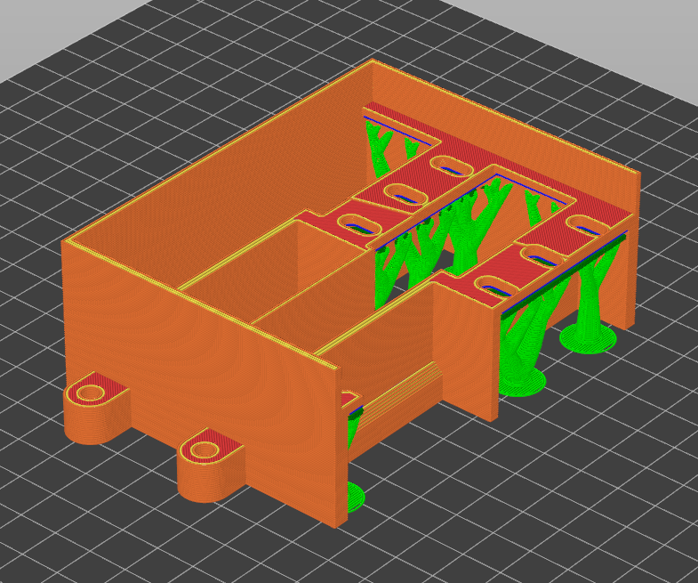

# One fan, two gpus

This repo contains the free 3d files for the fan i use in my compute server. It uses a single 150mm 12V blower fan to push a lot of air through not one but two gpus at once, with minimal noise compared to other solutions.

here is how i use it:

# purchasing the fan
just type 150mm 12V blower fan on aliexpress, it costs about 15€ a piece, it's one of these:

# printing the parts

none of them actually need support except for the adapter part that screws into the MI50, this one should be printed like this:

for the others:

the print orientation of the fan body and cap are self explanatory... longest flat side, which should be the default

I print these with a 0.6mm diameter nozzle.